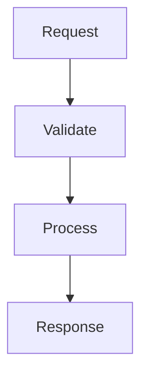

# Update Documentation

Update project documentation to reflect code changes.

## Usage

Run `/docs-update` to update documentation after significant changes.

## Documentation Files

### Main Docs
- `README.md` - Project overview and quick start
- `CLAUDE.md` - Claude Code project instructions
- `docs/chien_luoc_tong_the.md` - Strategic roadmap (Vietnamese)
- `docs/SCREENSHOTS_GUIDE.md` - Screenshots guide

### Architecture Docs
- `docs/adr/001-architecture-overview.md` - Architecture overview
- `docs/ai-triage-cards.md` - Triage Cards documentation
- `docs/phase-2-actions.md` - Actions system documentation

### API Documentation
- OpenAPI/Swagger at `http://localhost:8000/docs` (auto-generated)
- Update endpoint descriptions in route docstrings

### Phase Documentation
- `docs/phase-3-governance-skills.md` - Phase 3 design
- `docs/phase-3-implementation-plan.md` - Phase 3 plan
- `docs/skills-library-catalog.md` - Complete skill catalog

## When to Update

Update docs when:
- New API endpoints added
- New features implemented
- Architecture changes
- Configuration changes
- New environment variables added
- New skills added (Phase 3)

## Update Process

### 1. Code Changes
- Add docstrings to new functions/classes
- Update route descriptions
- Add type hints

### 2. API Docs
- Endpoint descriptions in route docstrings auto-appear in Swagger
- Update response models in Pydantic classes

### 3. Architecture Docs
- Update ADRs for architectural decisions
- Add new diagrams for new components

### 4. Phase Docs
- Update implementation plan progress
- Mark completed tasks with ✅
- Update status in `chien_luoc_tong_the.md`

## Docstring Format

### Backend (Python)
```python
async def analyze_incident(
    request: TriageCardRequest,
) -> TriageCard:
    """
    Analyze an incident and generate a Triage Card.

    Args:
        request: The triage card request with project and incident details.

    Returns:
        TriageCard with AI-generated analysis and recommendations.

    Raises:
        ValueError: If project not found or API key missing.
    """
```

### Frontend (TypeScript)
```typescript
/**
 * Hook for fetching alerts with polling fallback.
 *
 * @param enabled - Whether polling is enabled
 * @param interval - Polling interval in milliseconds
 * @returns Alert data and loading state
 */
export function useAlertNotifications(enabled: boolean, interval: number) {
```

## Diagrams

Use Mermaid diagrams in docs:


## Checking Doc Coverage

```bash
# Backend docstring coverage (if pydocstyle installed)
pydocstyle app/

# Frontend JSDoc coverage (eslint rule)
eslint . --plugin jsdoc
```
