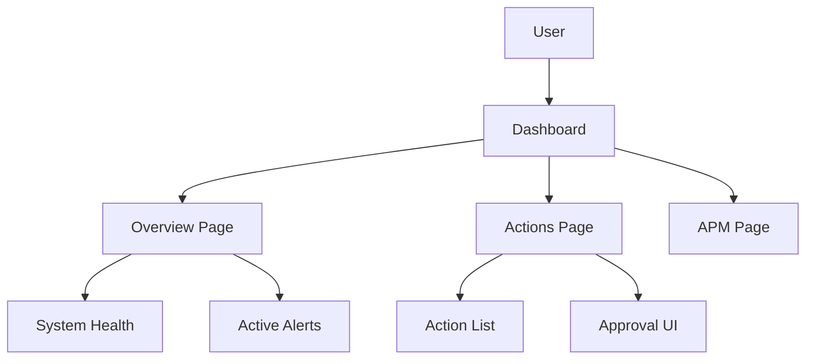

# Guide: Adding Screenshots to Documentation

This guide explains how to capture, optimize, and add screenshots to the DevOps AI Agentics 2026 documentation.

## Why Screenshots Matter

Screenshots help:
- **Users understand** what the dashboard looks like before installing
- **Documentation feel polished** and professional
- **Onboarding be faster** with visual references
- **Marketing and presentations** have ready assets

## Quick Start

### 1. Start the Application

```bash
# Option A: Docker Compose (Recommended)
docker compose up -d

# Option B: Manual (Development)
# Terminal 1 - Backend
cd backend
pip install -r requirements.txt
uvicorn app.main:app --reload --port 8000

# Terminal 2 - Frontend
cd frontend
npm install
npm run dev
```

### 2. Verify It's Running

```bash
# Check backend
curl http://localhost:8000/health

# Check frontend
curl http://localhost:3000
```

### 3. Capture Screenshots

#### Method 1: Browser DevTools (Easiest)

1. Open `http://localhost:3000` in your browser
2. Open DevTools (F12 or Cmd+Option+I)
3. Press `Cmd+Shift+P` (Mac) or `Ctrl+Shift+P` (Windows/Linux)
4. Type "screenshot" and select:
   - **"Capture full size screenshot"** - Entire page with scrolling
   - **"Capture node screenshot"** - Specific element (select element first)

#### Method 2: Command Line

```bash
# Using Chromium (if installed)
chromium --headless --screenshot=overview.png --window-size=1920,1080 http://localhost:3000/overview

# Using Puppeteer
npx puppeteer-cli screenshot http://localhost:3000/overview --output overview.png --full-page

# Using playwright-cli
npx playwright-cli screenshot http://localhost:3000/overview --output overview.png
```

## Screenshots Checklist

### Overview Page (`/overview`)
- [ ] Normal state with healthy systems
- [ ] State with active alerts (trigger some test alerts)
- [ ] Dark mode (if supported)
- [ ] Responsive (mobile view)

### Actions Page (`/actions`)
- [ ] Empty state (no actions)
- [ ] With pending actions
- [ ] With executed actions
- [ ] Approval workflow state

### Triage Card Detail (`/triage/:id`)
- [ ] Critical severity
- [ ] Multiple findings
- [ ] Recommendations with commands

### APM Metrics (`/apm`)
- [ ] Transaction latency chart
- [ ] Error rate visualization
- [ ] Service breakdown

### Infrastructure (`/infrastructure`)
- [ ] Node metrics
- [ ] CPU/Memory charts

## Screenshot Optimization

### PNG Optimization

```bash
# Using optipng
optipng -o7 *.png

# Using pngcrush
pngcrush -ow *.png

# Using advpng (part of advancecomp)
advpng -z4 *.png
```

### Convert to WebP (Smaller Size)

```bash
# Convert PNG to WebP
cwebp -q 80 overview.png -o overview.webp

# Batch convert
for file in *.png; do
  cwebp -q 80 "$file" -o "${file%.png}.webp"
done
```

### Resize (If Needed)

```bash
# Using ImageMagick
convert overview.png -resize 1200x800> overview-resized.png

# The ">" prevents upscaling smaller images
```

## Naming Convention

Use this pattern:

```
{page}-{state}-{timestamp}.{ext}

Examples:
- overview-normal-20260818.png
- overview-with-alerts-20260818.png
- actions-pending-20260818.png
- triage-card-critical-20260818.png
- apm-transactions-20260818.png
```

## Adding Screenshots to Markdown

### Basic Inline Image

```markdown
### Overview Dashboard


The overview dashboard provides a real-time view of all monitored systems.
```

### With Caption and Figure Number

```markdown

<div align="center">


*Figure 1: NOC-style overview dashboard with real-time system health monitoring*

</div>
```

### With Zoom/Click-to-Enlarge

```markdown

<a href="../images/screenshots/overview-normal-20260818.png" target="_blank">
  
</a>

*Click to enlarge*

```

### Multiple Screenshots Side-by-Side

```markdown

| Overview (Normal) | Overview (With Alerts) |
|-------------------|------------------------|
|  |  |

```

## Using SVG Mockups as Placeholders

When actual screenshots aren't available yet, use the SVG mockups in `docs/images/mockups/`:

```markdown
### Overview Dashboard


*Figure 1: NOC-style overview dashboard (wireframe mockup)*
```

## Automation Scripts

### Capture All Screenshots

Create `scripts/capture-screenshots.sh`:

```bash
#!/bin/bash

BASE_URL="http://localhost:3000"
OUTPUT_DIR="docs/images/screenshots"
TIMESTAMP=$(date +%Y%m%d)

# Ensure output directory exists
mkdir -p "$OUTPUT_DIR"

# Capture each page
pages=(
  "overview"
  "actions"
  "apm"
  "infrastructure"
  "slo"
)

for page in "${pages[@]}"; do
  echo "Capturing $page..."
  chromium --headless \
    --screenshot="$OUTPUT_DIR/${page}-${TIMESTAMP}.png" \
    --window-size=1920,1080 \
    "$BASE_URL/$page"
done

echo "Screenshots saved to $OUTPUT_DIR"
```

### Optimize All Screenshots

Create `scripts/optimize-screenshots.sh`:

```bash
#!/bin/bash

IMAGE_DIR="docs/images/screenshots"

echo "Optimizing PNG files..."
optipng -o7 "$IMAGE_DIR"/*.png

echo "Converting to WebP..."
for file in "$IMAGE_DIR"/*.png; do
  cwebp -q 80 "$file" -o "${file%.png}.webp"
done

echo "Done!"
```

## Fallback UI for Documentation

If you're writing documentation but don't have the app running:

### Option 1: Use SVG Mockups

```markdown
<!-- Use existing SVG mockup -->

```

### Option 2: Use HTML Placeholder

```markdown

<div align="center">

```html
<div style="width: 100%; max-width: 1200px; height: 400px;
            background: #f8fafc; border: 2px dashed #cbd5e1;
            display: flex; align-items: center; justify-content: center;
            border-radius: 8px; margin: 20px 0;">
  <span style="color: #64748b; font-size: 16px;">
    Screenshot placeholder - Actions Dashboard
  </span>
</div>
```

*Figure 2: Actions Dashboard (screenshot pending)*

</div>
```

### Option 3: Use Mermaid Diagram

```markdown



*Figure 3: Dashboard Navigation Structure*

```

## Best Practices

### DO
- ✅ Use consistent naming convention
- ✅ Optimize images before committing
- ✅ Use WebP for smaller file sizes
- ✅ Add descriptive alt text
- ✅ Include figure numbers and captions
- ✅ Keep screenshots up to date with UI changes

### DON'T
- ❌ Commit unoptimized screenshots (> 500KB per image)
- ❌ Use screenshots with sensitive data visible
- ❌ Use low-resolution screenshots (min 1200px width recommended)
- ❌ Forget to update screenshots when UI changes
- ❌ Use screenshots with test/personal data

## Testing Screenshots

Before committing screenshots, verify:

```bash
# Check file sizes
ls -lh docs/images/screenshots/

# Images should be under 500KB ideally
# If larger, optimize with optipng or convert to WebP

# Check image dimensions
file docs/images/screenshots/*.png

# Width should be at least 1200px for clarity
```

## CI/CD Integration

Add to `.github/workflows/docs.yml`:

```yaml
name: Check Screenshots

on:
  pull_request:
    paths:
      - 'docs/images/screenshots/**'

jobs:
  check-screenshots:
    runs-on: ubuntu-latest
    steps:
      - uses: actions/checkout@v3

      - name: Check image sizes
        run: |
          for file in docs/images/screenshots/*.png; do
            size=$(stat -f%z "$file" 2>/dev/null || stat -c%s "$file")
            if [ $size -gt 524288 ]; then
              echo "❌ $file is too large (>500KB). Please optimize."
              exit 1
            fi
          done
          echo "✅ All screenshots are optimized."
```

## Resources

- [MDN: Responsive Images](https://developer.mozilla.org/en-US/docs/Learn/HTML/Multimedia_and_embedding/Responsive_images)
- [WebP Documentation](https://developers.google.com/speed/webp)
- [PNG Optimization Guide](https://pngquantization.libpng.org/)
